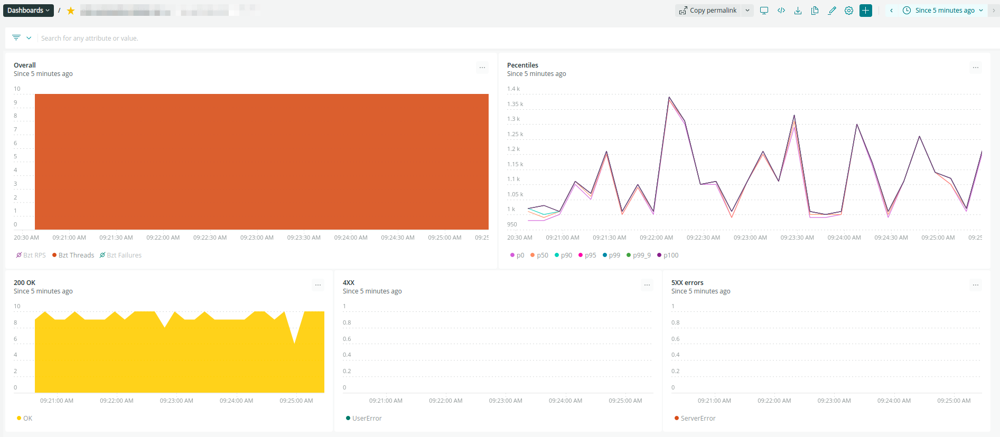

# NewRelicUploader

Taurus plugin to stream results to NewRelic API

## Installation

```bash
git clone https://github.com/doctornkz/newrelicUploader.git
cd newrelicUploader/
pip install .
```

## Example of configuration file

```ini
execution:
- executor: pbench
  concurrency: 10
  hold-for: 10m
  ramp-up: 2m
  #iterations: 100
  throughput: 10
  scenario:
    requests:
      - url: https://example.com/
        label: pbench

reporting:
  - module: newrelic

modules:
    console:
      disable: true
      screen: console

    newrelic:
      dashboard-url: https://onenr.io/PLACEHOLDER
      project: my_project
      browser-open: none  # auto-open the report in browser, 
                            # can be "start", "end", "both", "none"
      send-interval: 5s   # send data each n-th second
      # token-file: token.txt
      # custom-tags:
      #   example: '1'

```

## Authentification

You can use:

- `NEW_RELIC_INSERT_KEY` environment variable to pass the token
- `token` from configuration file (see example above)
- String from file `token-file` (see example above)
If it's failing, test will be intterupted.

## Starting

```bash
bzt load.yaml 
09:37:30 INFO: Taurus CLI Tool v1.14.2
09:37:30 INFO: Starting with configs: ['load.yaml']
09:37:30 INFO: Configuring...
09:37:30 INFO: Artifacts dir: /root
09:37:30 INFO: Preparing...
09:37:30 INFO: Token not found in config file
09:37:30 INFO: Token found in NEW_RELIC_INSERT_KEY environment variable
09:37:31 INFO: Starting...
09:37:31 INFO: Waiting for results...
09:37:31 INFO: Started data feeding: https://onenr.io/***
09:37:32 WARNING: There is newer version of Taurus 1.16.3 available, consider upgrading. What is new: http://gettaurus.org/docs/Changelog/
09:37:37 INFO: Current: 10 vu   10 succ 0 fail  1.000 avg rt    /       Cumulative: 1.000 avg rt, 0% failures
09:37:42 INFO: Current: 10 vu   10 succ 0 fail  1.001 avg rt    /       Cumulative: 1.022 avg rt, 0% failures
09:37:47 INFO: Current: 10 vu   11 succ 0 fail  1.007 avg rt    /       Cumulative: 1.032 avg rt, 0% failures
09:37:51 INFO: Current: 10 vu   9 succ  0 fail  0.993 avg rt    /       Cumulative: 1.031 avg rt, 0% failures
09:37:56 INFO: Current: 10 vu   10 succ 0 fail  1.011 avg rt    /       Cumulative: 1.044 avg rt, 0% failures
09:38:02 INFO: Current: 10 vu   10 succ 0 fail  1.104 avg rt    /       Cumulative: 1.044 avg rt, 0% failures
09:38:06 INFO: Current: 10 vu   9 succ  0 fail  1.160 avg rt    /       Cumulative: 1.052 avg rt, 0% failures
09:38:12 INFO: Current: 10 vu   10 succ 0 fail  0.986 avg rt    /       Cumulative: 1.056 avg rt, 0% failures
09:38:17 INFO: Current: 10 vu   10 succ 0 fail  1.100 avg rt    /       Cumulative: 1.055 avg rt, 0% failures
09:38:22 INFO: Current: 10 vu   9 succ  0 fail  0.999 avg rt    /       Cumulative: 1.057 avg rt, 0% failures
09:38:26 INFO: Current: 10 vu   9 succ  0 fail  0.992 avg rt    /       Cumulative: 1.056 avg rt, 0% failures
09:38:31 INFO: Current: 10 vu   9 succ  0 fail  1.200 avg rt    /       Cumulative: 1.057 avg rt, 0% failures
09:38:31 WARNING: Please wait for graceful shutdown...
09:38:31 INFO: Shutting down...
09:38:31 INFO: Post-processing...
09:38:31 INFO: Test duration: 0:01:00
09:38:31 INFO: Samples count: 549, 0.00% failures
09:38:31 INFO: Average times: total 1.053, latency 0.000, connect 0.000
09:38:31 INFO: Percentiles:
┌───────────────┬───────────────┐
│ Percentile, % │ Resp. Time, s │
├───────────────┼───────────────┤
│           0.0 │          0.98 │
│          50.0 │          1.01 │
│          90.0 │          1.16 │
│          95.0 │          1.21 │
│          99.0 │          1.31 │
│          99.9 │          1.31 │
│         100.0 │          1.31 │
└───────────────┴───────────────┘
09:38:31 INFO: Request label stats:
┌──────────────────────┬────────┬─────────┬────────┬───────┐
│ label                │ status │    succ │ avg_rt │ error │
├──────────────────────┼────────┼─────────┼────────┼───────┤
│ https://example.com/ │   OK   │ 100.00% │  1.053 │       │
└──────────────────────┴────────┴─────────┴────────┴───────┘
09:38:31 INFO: Sending remaining KPI data to server...
09:38:33 INFO: Report link: https://onenr.io/***
09:38:33 INFO: Artifacts dir: /root
09:38:33 INFO: Done performing with code: 0
```

## Dashboard example


